# Drop Ceiling — Renderable Diagrams (Mermaid + Graphviz)

*Renderable counterparts to the ◧ DRAW blocks in
[ACADIA_2026_DIAGRAM_GUIDE.md](ACADIA_2026_DIAGRAM_GUIDE.md). Prose lives there; this
file is figures only.*

**Framework choice:** **Mermaid** is used for all flow/state figures (§A) — it renders
natively in GitHub/VS Code/Notion, exports to SVG/PNG, and its `stateDiagram-v2` is
ideal for the mode machine. **Graphviz** is used (§B) only for the three figures where it
is objectively better: the tiered DB funnel (rank control), the concentric nested loops
(filled clusters), and the to-scale spatial plan (`neato` with real cm coordinates).

> Rendering quick-start: paste Mermaid blocks into <https://mermaid.live> or any Markdown
> preview that supports Mermaid; render Graphviz with `dot -Tsvg f.dot -o f.svg` (or
> `neato` where noted), or at <https://dreampuf.github.io/GraphvizOnline>.

---

# §A — Mermaid figures

## A1. Top-level pipeline (§1)

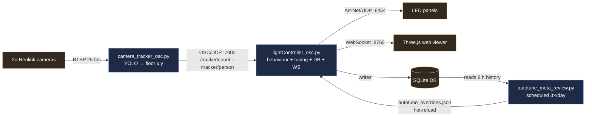

## A2. Three nested loops (§2)

*Mermaid can show containment via nested subgraphs (below). For true concentric rings
see the Graphviz version in §B2.*

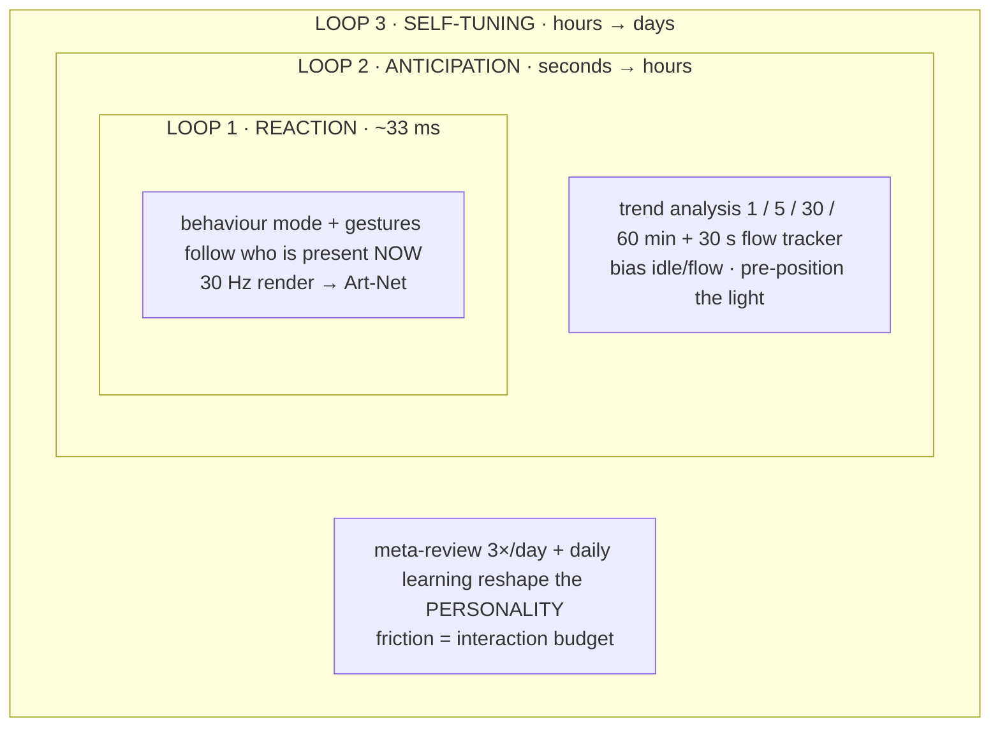

## A3. Mode state machine (§4) — *the strongest Mermaid case*

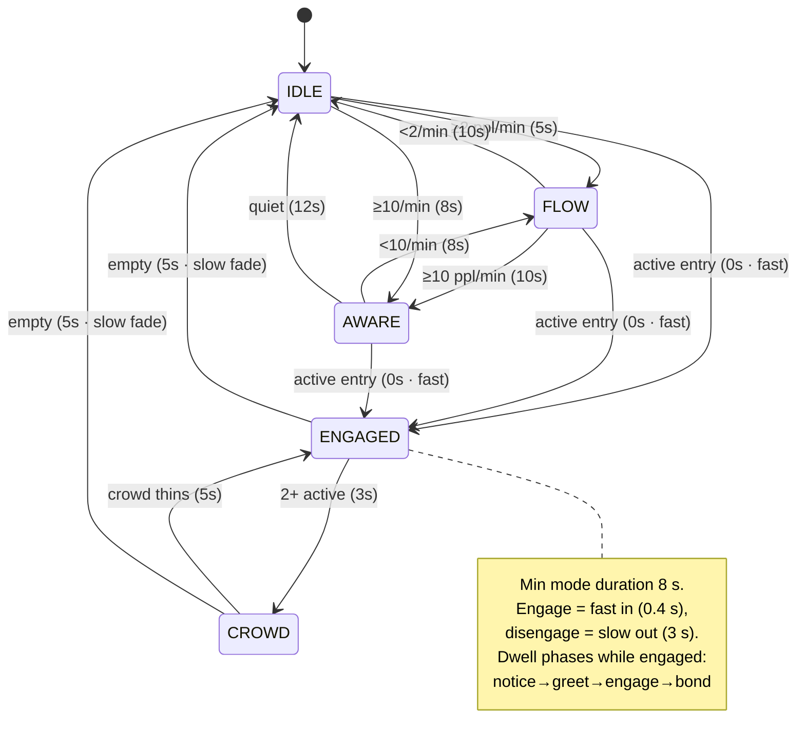

## A4. Modulation chain — how a meta-parameter becomes light (§3c)

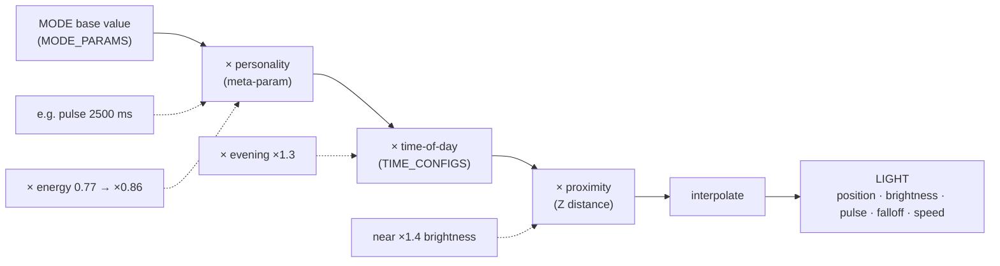

## A5. Trend windows → influence signals (§5)

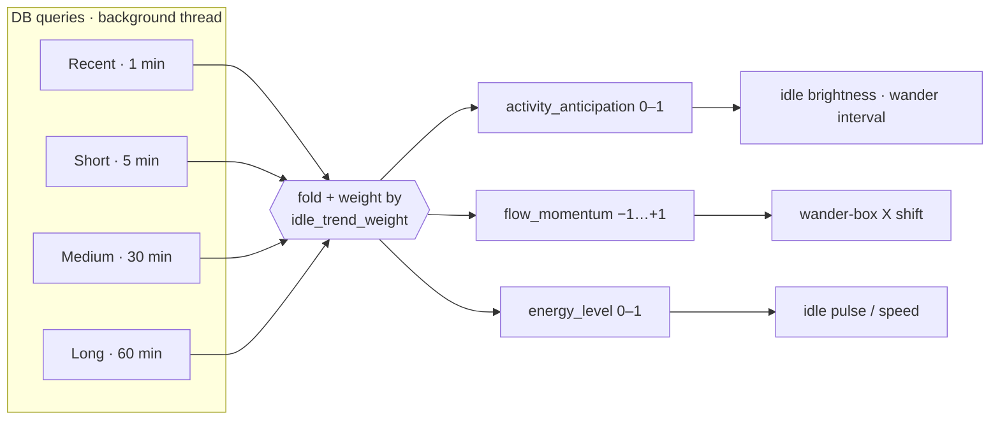

## A6. Aggression as a regulated tank (§5)

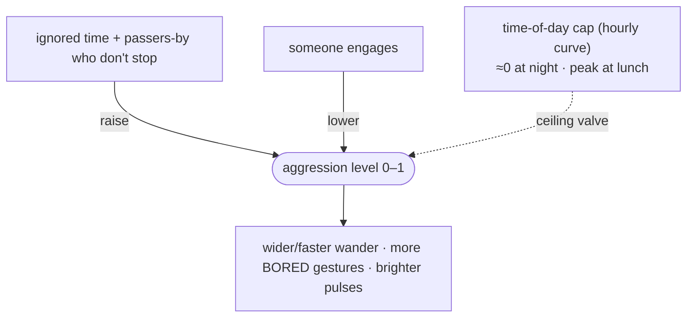

## A7. Self-tuning feedback with the interaction budget (§6c) — *key figure*

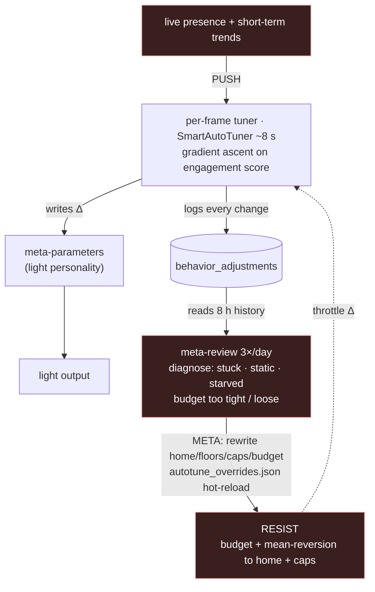

## A8. Interaction-budget mechanism (§6b)

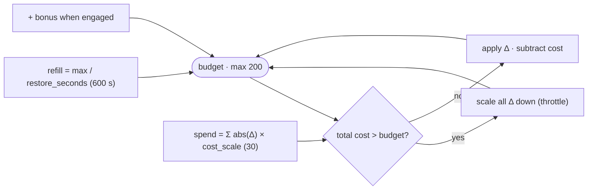

## A9. Self-analysis mirror loop (§7)

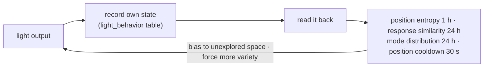

## A10. Real-time ingestion pipeline (§9)

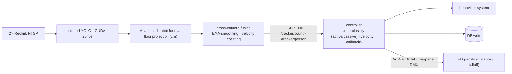

## A11. Web interface — two data planes (§10)

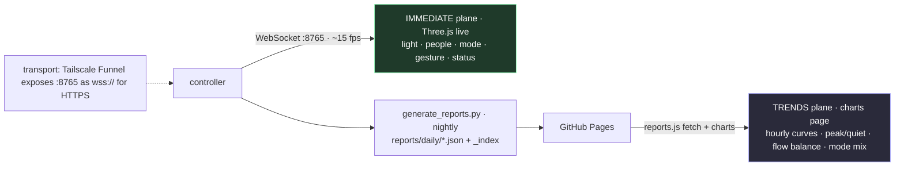

---

# §B — Graphviz figures (where it beats Mermaid)

## B1. Tiered database funnel (§8) — *rank control gives clean columns*

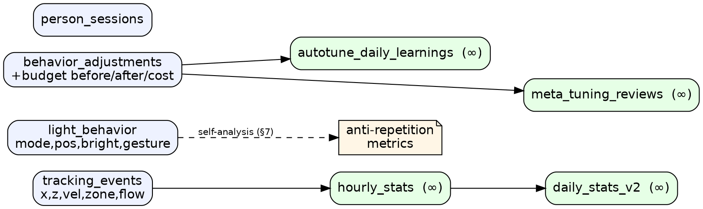

## B2. Concentric nested loops (§2) — *filled clusters = true containment*

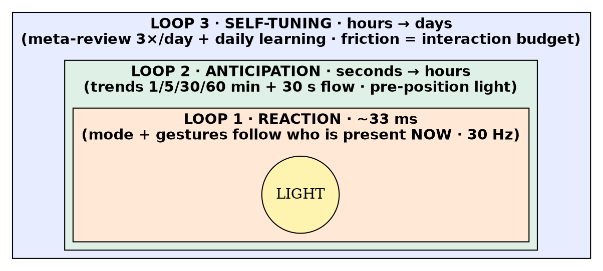

## B3. Spatial plan, to scale (§9) — *`neato` pins real cm coordinates*

*Coordinates from the source (cm; X along the storefront 0 → −300, Z out toward the
street). Node positions are `X·0.02, Z·0.02` inches so the plan is geometrically true.
Render with **neato**: `neato -Tsvg plan.dot -o plan.svg`. Overlay the active/passive
zone rectangles in your drawing tool (bounds noted below).*

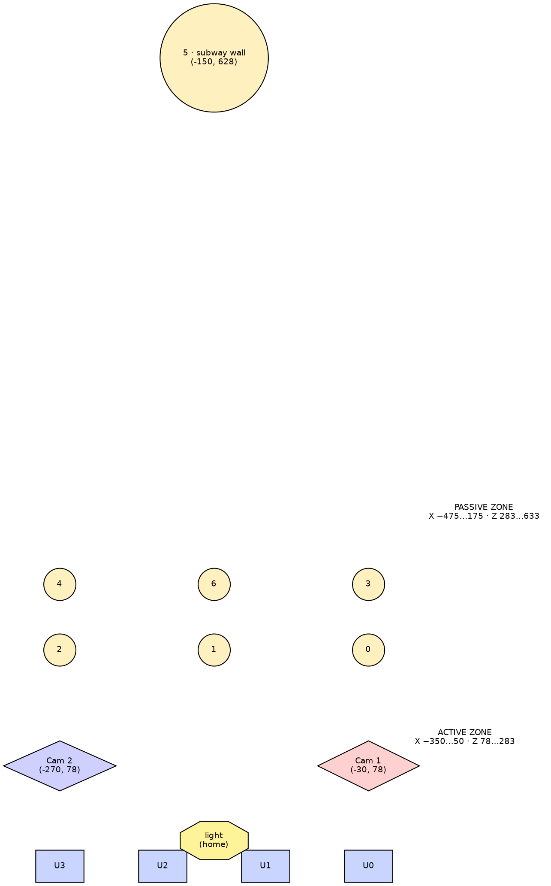

---

## Notes / fidelity

- **State-machine timings** (A3) are the V6.5c stickiness values from `MODE_STICKINESS`
  in `light_behavior.py`; mode thresholds (≥2 / ≥10 ppl·min⁻¹, ≥1 / ≥2 active) from
  `determine_mode()`.
- **Budget constants** (A7/A8) — `max 200`, `restore_seconds 600`, `cost_scale 30` — are
  the production values from `autotune_overrides.json`.
- The **spatial plan** (B3) uses authoritative `TRACKZONE` / `PASSIVE_TRACKZONE` and
  camera/marker coordinates from `lightController_osc.py`. Mermaid cannot pin geometry,
  which is why this one is Graphviz `neato`; for a publication figure, treat it as a
  layout reference and redraw to scale in CAD/Illustrator with the zone rectangles
  filled.
- If you prefer a single framework end-to-end, B1 and B2 also have the Mermaid
  equivalents above (A2, A8-area); only B3 truly requires Graphviz.
```
